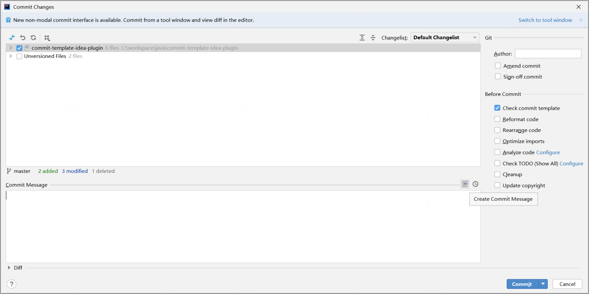
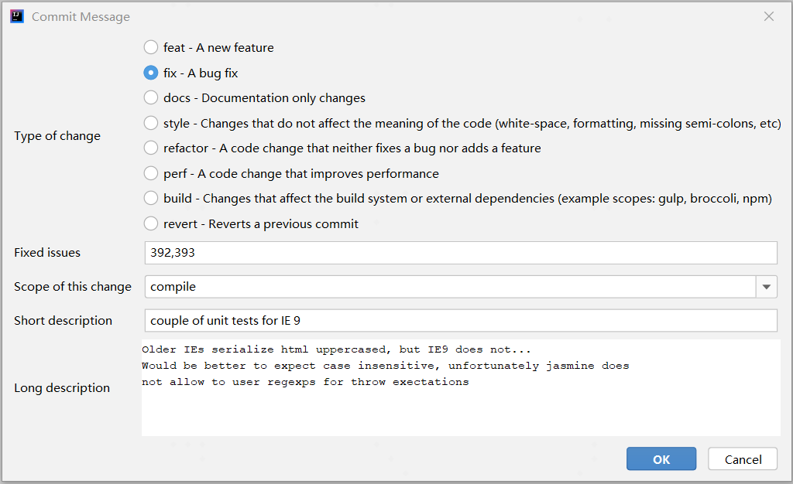
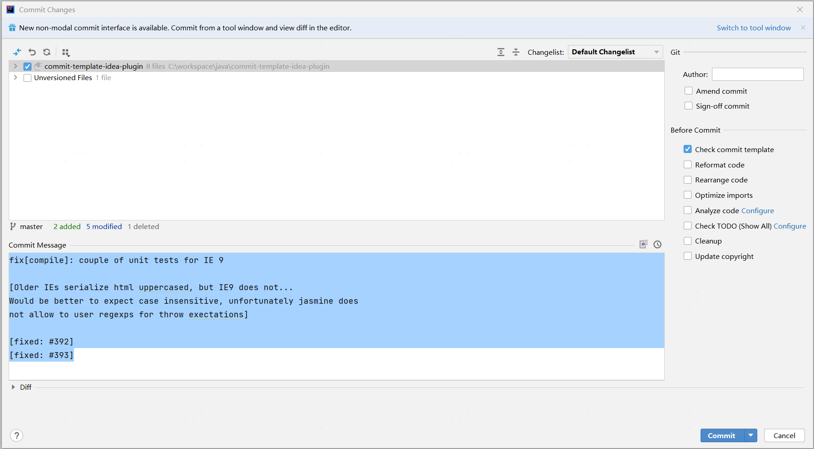

# Git commit template personal Plugin for IntelliJ

This plugin allows to create a commit message with the following template:

```
<type>[<scope>]: <subject>
<BLANK LINE>
<body>
<BLANK LINE>
<footer>
```

For example:

```
fix[compile]: couple of unit tests for IE 9

[Older IEs serialize html uppercased, but IE9 does not...
Would be better to expect case insensitive, unfortunately jasmine does
not allow to user regexps for throw exectations]

[fixed: #392]
[fixed: #393]
```

<p>The plug-in is based on <a href="https://plugins.jetbrains.com/plugin/9861-git-commit-template">Git Commit Template</a></p>

## Installation

Install directly from the IDE plugin manager (File > Settings > Plugins > Browser repositories > Git Commit Template Personal)

## Usage







## License

Licensed under the Apache License, Version 2.0 (the "License");
you may not use this file except in compliance with the License.
You may obtain a copy of the License at

   http://www.apache.org/licenses/LICENSE-2.0

Unless required by applicable law or agreed to in writing, software
distributed under the License is distributed on an "AS IS" BASIS,
WITHOUT WARRANTIES OR CONDITIONS OF ANY KIND, either express or implied.
See the License for the specific language governing permissions and
limitations under the License.

